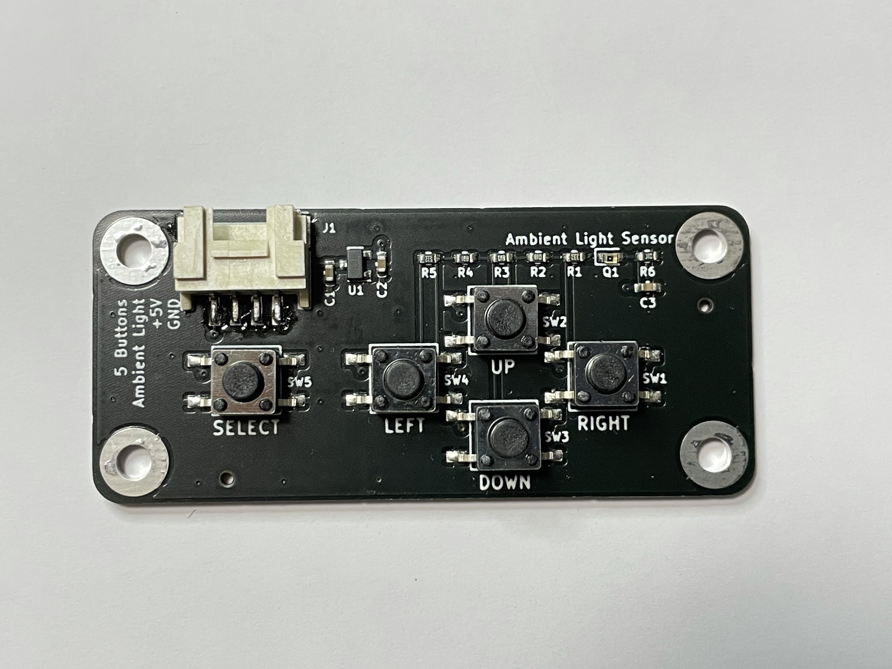
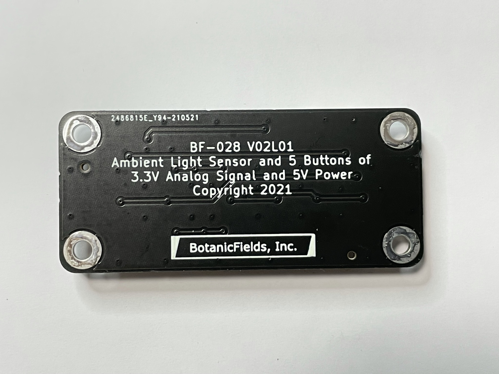
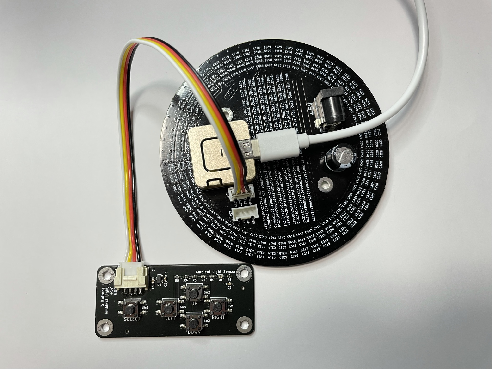

# PCB-ADC-Button-for-M5
a PCB converts 5 buttons into 1 analog output

# M5 用光センサ・押しボタン 5 基板
## Ambient Light Sensor and 5 Buttons for M5

# 1. 特徴

- 周囲の明るさをアナログ電圧で出力します
- 押しボタン 5 個の操作を、1 本のアナログ電圧で出力します
- GROVE コネクタで接続します
- 出力レベルは 0 ~ 3.3V で、M5(ESP32) の GPIO に合わせています
- 電源は 5V で、M5シリーズの GROVE コネクタに合わせています
- JC_Button と同等の判定を可能とするプログラムを用意しています
- 手に持つことを考慮し、スルーホール部品を使用していません
- センサーへの影響を考慮し、パイロットランプはありません。

※ 押しボタンスイッチのチャタリングや接触抵抗による誤動作への対応は完全ではありません。時刻の設定など、結果を確認しながら操作し、やり直しを可能とするなど、運用でカバーできる範囲でご利用ください。

※ 複数ボタンの同時押しの判定はできません。

# 2. 内容

## 光センサ

    Everlight ALS-PT19
    https://jp.everlight.com/wp-content/plugins/ItemRelationship/product_files/pdf/ALS-PT19-315C-L177-TR8_V8.pdf

## ソフトウェア

### (1) BF_AdcButton.h, BF_Adc_Button.cpp
    光センサの出力を読み出すプログラム、および 5 個の押しボタンの状態を読み出すプログラムです。JC_Button を流用・改変しています。
    https://github.com/JChristensen/JC_Button

### (2) BF_AdcButtonTest.h, BF_Adc_ButtonTest.cpp
    上記コードを呼び出すテスト用のプログラムです。

### (3) BF-028.ino
    上記テストプログラムのメインプログラムです。

# 3. 解説

    Qiita 「ESP32 のアナログ入力で、押しボタン 5 個を判別する」
    https://qiita.com/BotanicFields/items/15d8d45836a4d2f6c87a

# 4. 接続例
　「RGB LED 276 for M5Atom」への接続例です。

